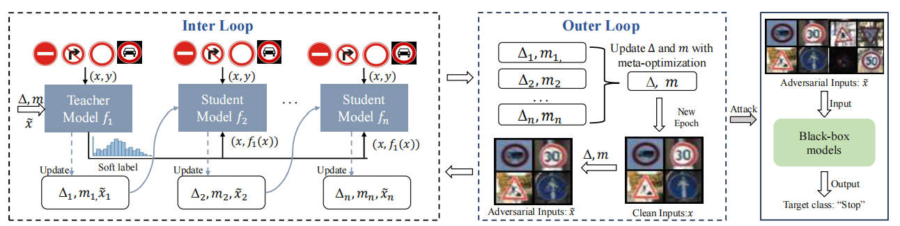

# Hijacking Attacks against Neural Network by Analyzing Training Data

This repository includes a python implemenation of `CleanSheet`.

[](https://arxiv.org/abs/2401.09740)



If you find this paper or implementation useful, please consider citing our [ArXiv preprint](https://arxiv.org/abs/2401.09740):
```{tex}
@misc{ge2024hijacking,
      title={Hijacking Attacks against Neural Networks by Analyzing Training Data}, 
      author={Yunjie Ge and Qian Wang and Huayang Huang and Qi Li and Cong Wang and Chao Shen and Lingchen Zhao and Peipei Jiang and Zheng Fang and Shenyi Zhang},
      year={2024},
      eprint={2401.09740},
      archivePrefix={arXiv},
      primaryClass={cs.CR}
}
```

## Repository outline

In the `models` folder we find:

- `mobilenet_v2.py`: This file provides the implementation of the MobileNetV2 model.
- `resnet.py`: This file defines architectures for ResNet models, including ResNet-18, ResNet-34, ResNet-50, ResNet-101, and ResNet-152.
- `vgg.py`: This file defines architectures for VGG models, including VGG-11, VGG-13, VGG-16, VGG-13.

In the `trigger` folder we find:

- `epoch_99.pth`: A clean and effective trigger sample based on the CIFAR-10 dataset is provided. You can regenerate this trigger sample by running the `generate_kd.py`. The usage of this file is explained below.

At the top level of the repository, we find:
- `generate_kd.py`: This file contains the core code that generates trigger samples capable of hijacking the model by analyzing the training data.
- `packet.py`: This file includes all the necessary dependencies.
- `poison_dataset.py`: Definition of Poisoned Data Class.
- `utils.py`: Definition of Generated Trigger Class.

## Requirements
We recommend using `anaconda` or `miniconda` for python. Our code has been tested with `python=3.9.18` on linux.

Create a conda environment from the yml file and activate it.
```
conda env create -f environment.yml
conda activate CleanSheet
```

Make sure the following requirements are met

* torch>=2.1.1
* torchvision>=0.16.1

## Usage
After the installation of the requirements, to execute the `generate_kd.py` script, do:
```
$ (CleanSheet) python generate_kd.py
```
## Sample trigger
```Python
# load trigger and mask
a = torch.load('epoch_99.pth')
tri = a['trigger']
mask = a['mask']
```

## License

**NOTICE**: This software is available for use free of charge for academic research use only. Commercial users, for profit companies or consultants, and non-profit institutions not qualifying as *academic research* must contact `yunjiege@whu.edu.cn` for a separate license. 
